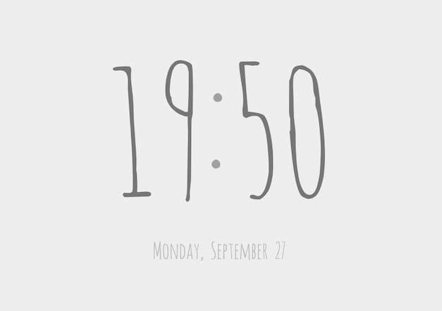

# Post

测试 Post

[test](./test.md)

<v-test>
## test template
</v-test>

[xxx][hello]

<!-- more -->

```js {3,5-8}
console.log('hello')
console.log('hello')
console.log('hello')
console.log('hello')
console.log('hello')
console.log('hello')
console.log('hello')
console.log('hello')
console.log('hello')
console.log('hello')
console.log('hello')
console.log('hello')
```

hello



[hello]: http://baidu.com
